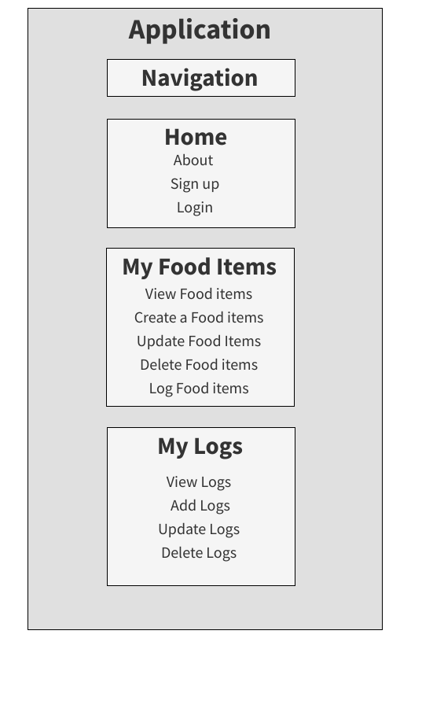
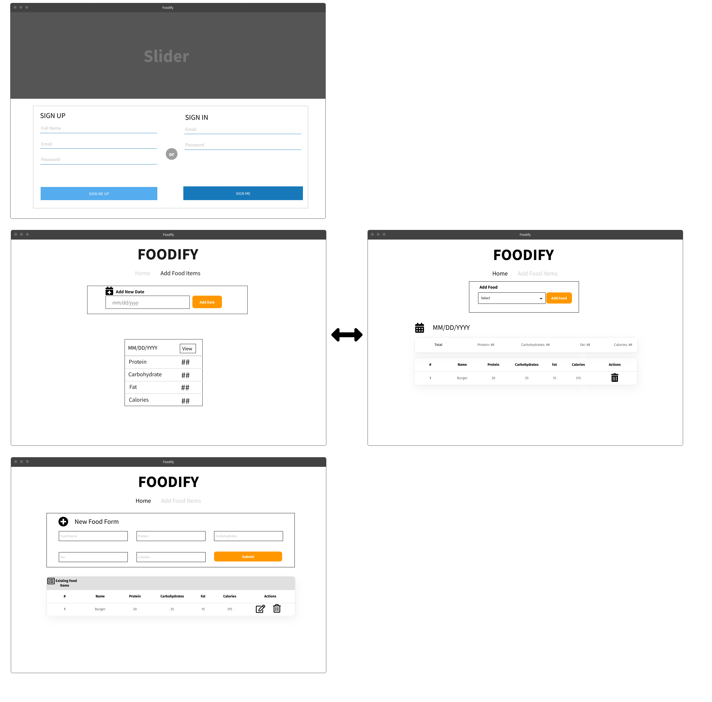

# Foodify

---
## Overview 
A food diary is a daily log of what you eat and drink each day. The diary helps you and your doctor understand your eating habits. It can help you realize what you consume. Once you know this, you can make changes to your diet to improve your weight.

---
## ERD - Entity Relationship Diagram

---
## User Stories 
* User would be able to create and account with the following name, email, and password. 
* User would be able to login with the following email and password. 
* User would be able to create, update, delete, log in, and view  your food items. 
* User would be able to create, update, delete, log in, and view your meals. 

--- 
## Routes
| PATH | ROUTE | Description |
| --- | --- | --- |
| /user | POST | Signup/Create user |
| /user/login | POST | Login user |
| /user | GET | Verify user |
| /meal| POST | Create a meal log|
| /meal | GET | Get all of the users meal log|
| /meal/:id | PUT | Update meal |
| /meal/:id | Delete | Delete meal |
| /food | POST | Create a food information|
| /food | GET | Get all of the users food information|
| /food/:id | GET | Get food item information|
| /food/:id | PUT | Update food item information|
| /food/:id | Delete | Delete food item information|

---
## Technology
* Backend - PostgreSQL, Flask, SQLAlchemy, Python
* Frontend - React, Javscript, HTML, CSS, MUI, Bootstrap

---
## Component Diagram

---
## Wireframes

---
## MVP - Minimum Viable Product
- [ ] Sign up, sign in, update, and delete a user
- [ ] Create, view, update, and delete meal logs 
- [ ] Create, view, update, and delete a food items

---
## Stretch Goals
- [ ] To be able to filter meal logs database
- [ ] Encrypytion 
- [ ] Mobile App

---
## Timeline 
* MVP by the end of Wednesday 1/11/2022
* Styliing by Thursday 1/12/2022
* Stretch Goals by Friday 1/14/2022

---
## Challenges/Obstacles
- Not too familiar with Python as javascript, but willing to give it a try. 